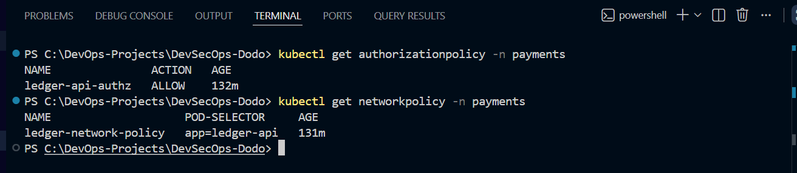

# 🚀 Enterprise DevSecOps Assignment

<div align="center">

# 🔐 Production-Grade DevSecOps Implementation

### Kubernetes • Secure CI/CD • GitOps • Istio Service Mesh • Zero Trust • Offensive Security


<br>


</div>

---

# 📌 About This Repository

This repository contains my complete solution for the **Enterprise DevSecOps Assessment**, demonstrating how a cloud-native application can be securely built, deployed, protected, delivered, and validated using modern DevSecOps practices.

Rather than focusing only on application deployment, this project implements security throughout the Software Delivery Lifecycle (SDLC), covering infrastructure hardening, secure CI/CD, GitOps, Zero Trust networking, and security validation.

The implementation follows a layered defense approach where each task builds upon the previous one to demonstrate a production-inspired DevSecOps workflow.

---

# 🎯 Project Goals

This repository demonstrates practical implementation of:

- Kubernetes Deployment & Hardening
- Infrastructure as Code Principles
- Secure Containerization
- GitHub Actions CI/CD
- GitOps using ArgoCD
- Container Image Security
- Secret Detection
- Static Application Security Testing (SAST)
- Container Vulnerability Scanning
- Image Signing
- Zero Trust Networking
- Istio Service Mesh
- Mutual TLS (mTLS)
- Identity-Based Authorization
- Kubernetes Network Policies
- Reconnaissance
- Web Application Security Assessment

---

# 🏆 Project Highlights

| Category | Implementation |
|-----------|----------------|
| ☸ Kubernetes | Production-Inspired Deployment |
| 🔒 Security | RBAC, Secrets, ConfigMaps, Service Accounts |
| 🐳 Containers | Dockerized Ledger API |
| 🚀 CI/CD | GitHub Actions |
| 🛡 Security Scanning | Gitleaks, Semgrep, Trivy |
| ✍ Supply Chain Security | Cosign Image Signing |
| 🔄 GitOps | ArgoCD |
| 🌐 Service Mesh | Istio |
| 🔐 Zero Trust | STRICT mTLS + AuthorizationPolicy |
| 🌍 Network Security | Kubernetes Network Policies |
| ⚔ Security Validation | Reconnaissance & Penetration Testing |

---

# 🏗 High-Level Architecture

```text
                            Developer
                                │
                                │ Git Push
                                ▼
                       GitHub Repository
                                │
                                ▼
                    GitHub Actions Pipeline
                                │
      ┌─────────────────────────┼─────────────────────────┐
      │                         │                         │
      ▼                         ▼                         ▼
 Gitleaks                  Semgrep                  Trivy Scan
Secret Detection              SAST            Container Vulnerabilities
      │                         │                         │
      └─────────────────────────┼─────────────────────────┘
                                │
                         Docker Image Build
                                │
                                ▼
                        Cosign Image Signing
                                │
                                ▼
                 GitHub Container Registry (GHCR)
                                │
                                ▼
                           ArgoCD GitOps
                                │
                                ▼
                     Kubernetes Cluster (Kind)
                                │
          ┌─────────────────────┴─────────────────────┐
          ▼                                           ▼
   Kubernetes Security                      Istio Service Mesh
 (RBAC, Secrets, NetworkPolicy)      (mTLS, AuthZ, SPIFFE Identity)
          │                                           │
          └─────────────────────┬─────────────────────┘
                                ▼
                        Flask Ledger API
```

---

# 📂 Repository Structure

```text
DevSecOps-Dodo
│
├── task-1-deploy-harden
│   ├── app/
│   ├── deploy/
│   ├── screenshots/
│   └── README.md
│
├── task-2-secure-cicd
│   ├── .github/
│   ├── manifests/
│   ├── argocd/
│   ├── screenshots/
│   └── README.md
│
├── task-3-istio-zero-trust
│   ├── manifests/
│   ├── screenshots/
│   └── README.md
│
├── task-4-pentest
│   ├── reports/
│   ├── screenshots/
│   └── README.md
│
└── README.md
```

---

# 📋 Assignment Overview

The repository is divided into four independent tasks, each representing a different stage of a production DevSecOps lifecycle.

| Task | Description |
|------|-------------|
| 🔐 Task 1 | Secure Kubernetes Deployment & Hardening |
| 🚀 Task 2 | Secure CI/CD Pipeline & GitOps |
| 🛡 Task 3 | Istio Service Mesh & Zero Trust |
| ⚔ Task 4 | Reconnaissance & Penetration Testing |

Each task includes:

- Detailed Documentation
- Kubernetes Manifests
- Configuration Files
- Screenshots
- Security Reports (where applicable)

---

# 🛠 Technology Stack

## Cloud Native

- Kubernetes
- Kind
- Docker
- Istio
- ArgoCD

---

## DevSecOps

- GitHub Actions
- GitHub Container Registry (GHCR)
- Gitleaks
- Semgrep
- Trivy
- Cosign

---

## Programming & Automation

- Python
- Flask
- YAML
- Bash
- PowerShell

---

## Security

- Kubernetes RBAC
- Service Accounts
- ConfigMaps
- Secrets
- Network Policies
- AuthorizationPolicy
- Mutual TLS (mTLS)
- SPIFFE Workload Identity
- Zero Trust Architecture

---

## Security Assessment

- Nmap
- OWASP ZAP
- DNS Enumeration
- HTTP Header Analysis
- TLS Configuration Review

---

# 🔐 Task 1 — Secure Kubernetes Deployment & Hardening

## 📖 Overview

The objective of this task was to securely deploy a containerized **Flask-based Ledger API** on a local Kubernetes cluster while following production-inspired security best practices.

Instead of deploying only application resources, multiple Kubernetes security controls were implemented to improve workload isolation, availability, and operational security.

---

## 🎯 Objectives

- Deploy the application on Kubernetes
- Implement least-privilege access
- Separate configuration from application code
- Protect sensitive information using Kubernetes Secrets
- Improve workload reliability using health probes
- Apply production-inspired security hardening

---

## ✅ Implemented Components

| Component | Status |
|-----------|:------:|
| Dockerized Application | ✅ |
| Kubernetes Deployment | ✅ |
| Namespace Isolation | ✅ |
| ConfigMap | ✅ |
| Secret Management | ✅ |
| Service Account | ✅ |
| RBAC | ✅ |
| Security Context | ✅ |
| Readiness Probe | ✅ |
| Liveness Probe | ✅ |
| Resource Requests & Limits | ✅ |
| ClusterIP Service | ✅ |
| Ingress | ✅ |

---

# 🛡 Security Controls

### 🔐 Identity & Access Management

The application runs using a dedicated Kubernetes **Service Account** with **Role-Based Access Control (RBAC)** to follow the Principle of Least Privilege.

Implemented:

- Dedicated Service Account
- Kubernetes Role
- RoleBinding
- Restricted API permissions

---

### 🔑 Secret Management

Sensitive configuration is stored separately using **Kubernetes Secrets** instead of hardcoding credentials.

Examples include:

- Application Secret Keys
- Database Passwords
- Authentication Tokens

---

### ⚙ Configuration Management

Application configuration is managed through **ConfigMaps**.

Benefits:

- Configuration separated from application code
- Easy environment management
- Improved maintainability

---

### 🐳 Container Hardening

Security best practices applied:

- Non-root container execution
- Privilege escalation disabled
- Read-only filesystem (where applicable)
- Dropped Linux capabilities
- Security Context enabled

---

### ❤️ Health Monitoring

To improve reliability, Kubernetes continuously validates application health using:

- Liveness Probe
- Readiness Probe

This enables automatic recovery from failures while preventing traffic from reaching unhealthy pods.

---

# 🏗 Deployment Architecture

```text
                  Internet
                      │
                      ▼
                Kubernetes Ingress
                      │
                      ▼
              ClusterIP Service
                      │
          ┌───────────┼───────────┐
          ▼           ▼           ▼
      Ledger Pod  Ledger Pod  Ledger Pod
          │           │           │
          └───────────┼───────────┘
                      │
         ┌────────────┴────────────┐
         ▼                         ▼
    ConfigMap                Kubernetes Secret
         │                         │
         └────────────┬────────────┘
                      ▼
              Service Account
                      │
                     RBAC
```

---

# 📸 Task 1 Evidence

### Kubernetes Deployment


---

### Running Pods


---

### Kubernetes Services


---

### Health Endpoint


---

# ✅ Task 1 Outcome

Successfully deployed and secured the Ledger API using Kubernetes-native security features.

Key achievements:

- Secure workload deployment
- RBAC implementation
- Secret management
- Configuration separation
- Improved reliability
- Production-inspired security hardening

---

# 🚀 Task 2 — Secure CI/CD Pipeline & GitOps

## 📖 Overview

Task 2 implements a secure software delivery pipeline using **GitHub Actions** and **GitOps**.

Every code change passes through multiple automated security gates before deployment, ensuring that only validated container images are delivered to Kubernetes.

---

## 🎯 Objectives

- Automate software delivery
- Detect leaked secrets
- Perform static code analysis
- Scan container images
- Sign container images
- Deploy using GitOps

---

# 🔄 CI/CD Workflow

```text
Developer
     │
 Git Push
     │
     ▼
GitHub Repository
     │
     ▼
GitHub Actions
     │
 ┌──────────────┬───────────────┬───────────────┐
 ▼              ▼               ▼
Gitleaks    Semgrep         Docker Build
 │              │               │
 └──────────────┼───────────────┘
                ▼
           Trivy Scan
                │
                ▼
          Cosign Signing
                │
                ▼
     GitHub Container Registry
                │
                ▼
            ArgoCD GitOps
                │
                ▼
      Kubernetes Cluster
```

---

# 🛡 Security Gates

## 🔐 Gitleaks

Automatically scans the repository for accidentally committed secrets.

Examples:

- API Keys
- Tokens
- Passwords
- Credentials

---

## 🔍 Semgrep

Performs Static Application Security Testing (SAST).

Detects:

- Insecure coding practices
- Dangerous functions
- Security misconfigurations

---

## 🐳 Trivy

Performs container vulnerability scanning.

Checks include:

- Critical vulnerabilities
- High vulnerabilities
- Operating System packages
- Application dependencies

---

## ✍ Cosign

Container image signing provides:

- Image Integrity
- Image Authenticity
- Trusted Software Supply Chain

---

## 🚀 ArgoCD

GitOps continuously synchronizes Kubernetes with the Git repository.

Benefits:

- Version-controlled deployments
- Automated reconciliation
- Declarative infrastructure
- Reliable rollbacks

---

# 📊 Pipeline Summary

| Stage | Tool |
|--------|------|
| Source Control | GitHub |
| CI/CD | GitHub Actions |
| Secret Detection | Gitleaks |
| Static Analysis | Semgrep |
| Container Build | Docker |
| Vulnerability Scan | Trivy |
| Image Signing | Cosign |
| Container Registry | GHCR |
| GitOps | ArgoCD |
| Deployment | Kubernetes |

---

# 📸 Task 2 Evidence

### GitHub Actions Workflow


---

### Security Scanning


---

### ArgoCD Synchronization


---

# ✅ Task 2 Outcome

Successfully implemented a secure CI/CD pipeline with automated security validation.

Key achievements:

- Automated GitHub Actions pipeline
- Secret detection
- Static code analysis
- Container vulnerability scanning
- Image signing
- GitOps-based Kubernetes deployment

---

# 🛡 Task 3 — Istio Service Mesh & Zero Trust

## 📖 Overview

Task 3 extends the Kubernetes deployment by introducing **Istio Service Mesh** to implement a Zero Trust security model.

Instead of relying only on Kubernetes networking, Istio provides encrypted service-to-service communication, workload identity, and policy-based authorization.

The objective was to ensure that no workload is trusted by default and all communication is authenticated before access is granted.

---

# 🎯 Objectives

- Install Istio Service Mesh
- Enable Automatic Sidecar Injection
- Enforce STRICT Mutual TLS (mTLS)
- Apply Authorization Policies
- Restrict traffic using Kubernetes Network Policies
- Demonstrate Zero Trust Networking

---

# ✅ Implemented Features

| Feature | Status |
|----------|:------:|
| Istio Installation | ✅ |
| Sidecar Injection | ✅ |
| STRICT mTLS | ✅ |
| PeerAuthentication | ✅ |
| AuthorizationPolicy | ✅ |
| NetworkPolicy | ✅ |
| Zero Trust Architecture | ✅ |

---

# 🏗 Zero Trust Architecture

```text
              Client
                 │
                 ▼
        Istio Ingress Gateway
                 │
                 ▼
        Envoy Sidecar Proxy
                 │
          Mutual TLS (mTLS)
                 │
        Envoy Sidecar Proxy
                 │
                 ▼
           Ledger API Pod
                 │
        Authorization Policy
                 │
        Kubernetes NetworkPolicy
```

---

# 🔐 Mutual TLS (mTLS)

Mutual TLS was configured in **STRICT** mode to ensure:

- Encrypted communication
- Mutual authentication
- Secure service-to-service traffic
- Rejection of plaintext traffic

Implemented using:

- PeerAuthentication
- Istio Sidecars
- Istio CA

---

# 🛡 Authorization Policy

Authorization policies were applied to control communication based on workload identity.

Security benefits:

- Identity-based authorization
- Explicit allow rules
- Reduced attack surface
- Zero Trust enforcement

---

# 🌐 Kubernetes Network Policy

Network Policies were configured to limit pod communication.

Implemented:

- Namespace isolation
- Controlled ingress
- Restricted pod-to-pod communication

---

# 🛡 Defense in Depth

| Security Layer | Purpose |
|----------------|---------|
| Kubernetes RBAC | API Authorization |
| Service Account | Workload Identity |
| NetworkPolicy | Network Segmentation |
| Istio mTLS | Encryption |
| AuthorizationPolicy | Identity-Based Access |

---

# 📸 Task 3 Evidence

### Istio Installation


---

### STRICT Mutual TLS


---

### Authorization Policy & Network Policy



---

### Service Validation


---

### Istio Sidecar Proxy


---

# ✅ Task 3 Outcome

Successfully implemented a Zero Trust networking model using Istio.

Achievements:

- Encrypted service communication
- Mutual authentication
- Identity-based authorization
- Network segmentation
- Defense-in-depth security

---

# ⚔ Task 4 — Reconnaissance & Penetration Testing

## 📖 Overview

Task 4 demonstrates a practical security assessment following the assignment's Rules of Engagement.

The work was divided into two phases:

- **Part A – Passive Reconnaissance**
- **Part B – Authorized Security Assessment**

Passive reconnaissance was performed only against publicly available information, while active testing was limited to the authorized local Ledger API deployed in Kubernetes.

---

# 🔍 Part A — Passive Reconnaissance

Passive reconnaissance focused on identifying publicly exposed information without performing intrusive actions.

Activities included:

- DNS Enumeration
- HTTP Header Analysis
- HTTPS Redirect Validation
- TLS Configuration Review

Commands used:

```bash
nslookup dodopayments.tech

curl.exe -I https://dodopayments.tech
```

---

## Reconnaissance Observations

- Domain successfully resolved
- Cloudflare reverse proxy detected
- HTTPS enforced
- `.tech` domain redirects to `.com`
- Minimal server information exposed

---

# 🛡 Part B — Authorized Security Assessment

Security validation was performed against the authorized local Ledger API running inside Kubernetes.

The following activities were completed:

- Port Discovery
- Service Enumeration
- API Validation
- Passive Web Security Assessment

---

# 🛠 Tools Used

| Tool | Purpose |
|------|---------|
| Nmap | Port Enumeration |
| OWASP ZAP | Passive Security Assessment |
| Curl | API Validation |
| nslookup | DNS Enumeration |
| SSL Labs | TLS Review |

---

# 🔍 Security Assessment

## Network Reconnaissance

```bash
nmap -Pn -sT -p 8081 localhost
```

Validated:

- Open TCP Port
- Reachable HTTP Service
- Running Application

---

## API Validation

```bash
curl http://localhost:8081/health
```

Verified:

- Application Availability
- HTTP Response
- Health Endpoint

---

## OWASP ZAP

Passive analysis identified:

- Missing Security Headers
- Information Disclosure
- Passive Security Alerts

No intrusive exploitation techniques were performed.

---

# 🚨 Key Findings

| Severity | Finding | Status |
|-----------|----------|--------|
| 🟢 Informational | Cloudflare Detected | Verified |
| 🟢 Informational | HTTPS Redirect | Verified |
| 🟢 Informational | API Health Endpoint | Verified |
| 🟡 Low | Missing Security Headers | Recommendation Provided |
| 🟢 Informational | Passive ZAP Alerts | Reviewed |

---

# 🛡 Security Recommendations

- Implement additional HTTP Security Headers
- Continue enforcing HTTPS
- Minimize information disclosure
- Perform periodic vulnerability assessments
- Integrate automated security testing into CI/CD

---

# 📸 Task 4 Evidence

### Nmap Scan


---

### OWASP ZAP Scan


---

### OWASP ZAP Alerts


---

### Ledger API Health Check


---

### DNS Enumeration


---

### HTTP Header Analysis


---

### TLS Configuration Review


---

# 📑 Reports

Detailed documentation is available under:

```text
task-4-pentest/reports/

├── Recon-Report.md
└── Pentest-Report.md
```

The reports include:

- Scope
- Methodology
- Findings
- Risk Analysis
- Recommendations

---

# 📸 Project Screenshots

The repository includes screenshots demonstrating each stage of the implementation.

## 🔐 Task 1 – Secure Kubernetes Deployment

- Kubernetes Deployment
- Running Pods
- Kubernetes Services
- Secrets & ConfigMaps
- Health Endpoint

📁 `task-1-deploy-harden/screenshots/`

---

## 🚀 Task 2 – Secure CI/CD

- GitHub Actions Workflow
- Security Scanning
- ArgoCD Synchronization

📁 `task-2-secure-cicd/screenshots/`

---

## 🛡 Task 3 – Istio Zero Trust

- Istio Installation
- STRICT mTLS
- Authorization Policy
- Network Policy
- Service Validation
- Istio Sidecar Injection

📁 `task-3-istio-zero-trust/screenshots/`

---

## ⚔ Task 4 – Reconnaissance & Security Assessment

- Nmap Scan
- OWASP ZAP Scan
- ZAP Alerts
- Health API Validation
- DNS Enumeration
- HTTP Header Analysis
- TLS Configuration Review

📁 `task-4-pentest/screenshots/`

---

# 🚀 Quick Start

## Clone the Repository

```bash
git clone https://github.com/mohit-72/devsecops-dodo.git

cd devsecops-dodo
```

---

## Repository Layout

```text
task-1-deploy-harden/
task-2-secure-cicd/
task-3-istio-zero-trust/
task-4-pentest/
```

Each task contains:

- Documentation
- Kubernetes Manifests
- Configuration Files
- Screenshots
- Reports (where applicable)

---

# 🏅 Skills Demonstrated

## ☸ Kubernetes

- Deployments
- Services
- Ingress
- Namespaces
- ConfigMaps
- Secrets
- RBAC
- Service Accounts
- Security Context
- Health Probes

---

## 🚀 DevSecOps

- Secure CI/CD
- GitHub Actions
- GitOps
- Docker
- ArgoCD
- Container Security
- Image Signing
- Security Automation

---

## 🔐 Cloud & Platform Security

- Kubernetes Hardening
- Secret Management
- Least Privilege Access
- Network Segmentation
- Zero Trust
- Mutual TLS (mTLS)
- Authorization Policies
- Defense in Depth

---

## 🛡 Security Testing

- Reconnaissance
- DNS Enumeration
- HTTP Header Analysis
- TLS Review
- Nmap
- OWASP ZAP
- Security Reporting

---

# 📈 Project Outcomes

This project demonstrates the implementation of a production-inspired DevSecOps workflow covering application deployment, secure software delivery, Zero Trust networking, and security validation.

### Successfully Implemented

- ✅ Secure Kubernetes Deployment
- ✅ Infrastructure Hardening
- ✅ Secret Management
- ✅ RBAC & Least Privilege
- ✅ GitHub Actions CI/CD
- ✅ Automated Security Checks
- ✅ Container Vulnerability Scanning
- ✅ Container Image Signing
- ✅ GitOps with ArgoCD
- ✅ Istio Service Mesh
- ✅ STRICT Mutual TLS
- ✅ Authorization Policies
- ✅ Network Policies
- ✅ Passive Reconnaissance
- ✅ Authorized Security Assessment
- ✅ Professional Documentation

---

# 📚 Key Learnings

During this assessment I gained hands-on experience with:

- Kubernetes Administration
- Secure Container Deployment
- CI/CD Security
- GitOps Workflows
- Service Mesh Architecture
- Zero Trust Security
- Cloud Native Security
- Security Assessment
- Threat-Driven Thinking
- DevSecOps Best Practices

---

# 🔮 Future Improvements

This project can be extended with:

- Helm Charts
- Kustomize
- Prometheus & Grafana
- Falco Runtime Security
- Kyverno Policies
- OPA Gatekeeper
- HashiCorp Vault
- SBOM Generation
- SLSA Provenance
- Horizontal Pod Autoscaler
- Canary Deployments
- Blue-Green Deployments

---

# 📁 Reports

Detailed reports are available inside the repository.

```text
task-4-pentest/
└── reports/
    ├── Recon-Report.md
    └── Pentest-Report.md
```

These reports include:

- Assessment Scope
- Methodology
- Reconnaissance Results
- Security Findings
- Risk Analysis
- Recommendations

---

# 👨‍💻 About Me

## Mohit Yadav

**Cloud & DevSecOps Engineer**

Passionate about building secure, scalable, and cloud-native infrastructure using modern DevOps and DevSecOps practices.

### Technical Skills

- Microsoft Azure
- Kubernetes
- Docker
- Terraform
- GitHub Actions
- ArgoCD
- Istio
- Linux
- Python
- Bash
- PowerShell

---

# ⭐ Support

If you found this repository useful, consider giving it a **Star ⭐** on GitHub.

Your support motivates me to continue building production-grade Cloud, Kubernetes, and DevSecOps projects.

---

<div align="center">

# 🚀 Build Secure • Automate Everything • Trust Nothing

### Cloud • Kubernetes • DevSecOps • GitOps • Zero Trust

Made with ❤️ by **Mohit Yadav**

</div>