# 🔐 Ledger API - Production Ready DevSecOps Deployment


---

# 📌 Overview

This project demonstrates a **production-style DevSecOps deployment** of a Flask-based Ledger API on Kubernetes.

The application has been containerized using Docker and deployed on a Kubernetes (Kind) cluster while implementing multiple Kubernetes security best practices including:

- Kubernetes Secrets
- ConfigMaps
- RBAC
- Service Accounts
- Security Context
- Resource Requests & Limits
- Readiness & Liveness Probes
- Kubernetes Service
- Ingress

The goal was not only to deploy the application but to make it production-ready following DevSecOps principles.

---

# ✨ Features

- Dockerized Flask Application
- Kubernetes Deployment
- Replica-based High Availability
- Kubernetes Service
- Kubernetes Ingress
- ConfigMap Integration
- Secret Management
- RBAC Authorization
- Dedicated Service Account
- Non-root Container Execution
- Read-only Root Filesystem
- Disabled Privilege Escalation
- Readiness Probe
- Liveness Probe
- Resource Requests & Limits
- REST API Validation

---

# 🏗 Architecture

```text
                        +----------------------+
                        |       Client         |
                        +----------+-----------+
                                   |
                                   |
                           Kubernetes Ingress
                                   |
                            ClusterIP Service
                                   |
          +------------------------+------------------------+
          |                        |                        |
    Ledger Pod 1             Ledger Pod 2             Ledger Pod 3
          |                        |                        |
          +------------------------+------------------------+
                                   |
                 +-----------------+------------------+
                 |                                    |
         Kubernetes Secret                    ConfigMap
                 |                                    |
                 +---------- Service Account ----------+
                                |
                               RBAC
```

---

# 🛠 Technology Stack

| Category | Technology |
|----------|------------|
| Language | Python 3.12 |
| Framework | Flask |
| Containerization | Docker |
| Orchestration | Kubernetes (Kind) |
| Networking | Service, Ingress |
| Security | Secret, RBAC, Service Account |
| Configuration | ConfigMap |
| Version Control | Git |
| CI/CD | GitHub Actions |

---

# 📂 Project Structure

```text
ledger-api-assignment
│
├── app
│   ├── app.py
│   ├── Dockerfile
│   └── requirements.txt
│
├── deploy
│   ├── namespace.yaml
│   ├── deployment.yaml
│   ├── service.yaml
│   ├── ingress.yaml
│   ├── configmap.yaml
│   ├── secret.yaml
│   ├── serviceaccount.yaml
│   └── rbac.yaml
│
├── screenshots
│   ├── 01-pods.png
│   ├── 02-deployment.png
│   ├── 03-service.png
│   ├── 04-secret.png
│   ├── 05-serviceaccount.png
│   ├── 06-rbac.png
│   ├── 07-configmap.png
│   ├── 08-ingress.png
│   ├── 09-health-api.png
│   ├── 10-transactions-api.png
│   └── 11-tokenize-api.png
│
├── .github
│   └── workflows
│       └── build.yml
│
├── .gitignore
└── README.md
```

---

# 🚀 Docker Build

```bash
cd app

docker build -t ledger-api:secure-v2 .
```

---

# ☸️ Load Image into Kind

```bash
kind load docker-image ledger-api:secure-v2 --name dodo-devsecops
```

---

# 🚀 Deploy to Kubernetes

```bash
kubectl apply -f deploy/namespace.yaml
kubectl apply -f deploy/secret.yaml
kubectl apply -f deploy/configmap.yaml
kubectl apply -f deploy/serviceaccount.yaml
kubectl apply -f deploy/rbac.yaml
kubectl apply -f deploy/service.yaml
kubectl apply -f deploy/ingress.yaml
kubectl apply -f deploy/deployment.yaml
```

---

# ✅ Kubernetes Verification

### Pods

```bash
kubectl get pods -n payments
```

### Deployment

```bash
kubectl get deployment -n payments
```

### Service

```bash
kubectl get svc -n payments
```

### Secret

```bash
kubectl get secret -n payments
```

### Service Account

```bash
kubectl get serviceaccount -n payments
```

### RBAC

```bash
kubectl get role,rolebinding -n payments
```

### ConfigMap

```bash
kubectl get configmap -n payments
```

### Ingress

```bash
kubectl get ingress -n payments
```

---

# 🌐 API Validation

### Health Endpoint

```bash
curl http://localhost:8081/health
```

Response

```json
{
  "status":"ok"
}
```

---

### Transactions Endpoint

```bash
curl http://localhost:8081/transactions
```

---

### Tokenization Endpoint

```powershell
Invoke-RestMethod -Uri "http://localhost:8081/tokenize" -Method POST -ContentType "application/json" -Body '{"pan":"4242424242424242"}'
```

Example Response

```json

{
  "last4": "4242",
  "token": "<payment-token>"
}

```

---

# 🛡 Security Hardening

The deployment follows Kubernetes security best practices.

- Kubernetes Secret for sensitive credentials
- ConfigMap for application configuration
- Dedicated Service Account
- RBAC (Least Privilege Access)
- Namespace Isolation
- Non-root Container Execution
- Read-only Root Filesystem
- Disabled Privilege Escalation
- Resource Requests & Limits
- Readiness Probe
- Liveness Probe
- Kubernetes Ingress

---

# 🔐 Istio Service Mesh & Zero Trust

The application is secured using an Istio Service Mesh implementing Zero Trust networking principles.

## Service Mesh Features

- Istio Service Mesh
- Automatic Sidecar Injection
- Mutual TLS (STRICT)
- Identity-Based Authorization
- Kubernetes NetworkPolicy
- Defense-in-Depth Security

---

## Mutual TLS (mTLS)

A PeerAuthentication policy is configured with **STRICT** mode.

```yaml
apiVersion: security.istio.io/v1
kind: PeerAuthentication
spec:
  mtls:
    mode: STRICT
```

This ensures that all communication between workloads inside the mesh is encrypted using mutual TLS.

---

## Identity-Based Authorization

Authorization is enforced using Istio AuthorizationPolicy.

Instead of trusting IP addresses, communication is allowed only for workloads with the correct Kubernetes Service Account (SPIFFE identity).

---

## Workload Certificates

Istiod automatically:

- Issues X.509 certificates
- Assigns SPIFFE identities
- Rotates certificates automatically before expiry
- Uses the Istio Root CA as the trust root

---

## Defense in Depth

### Istio AuthorizationPolicy

- Identity-based access control
- Mutual TLS authentication
- Zero Trust communication

### Kubernetes NetworkPolicy

- Layer 3 / Layer 4 traffic filtering
- Restricts ingress and egress traffic
- Provides network isolation between workloads

Both controls work together to provide defense in depth.

---

## Verification

```bash
kubectl get peerauthentication -n payments
kubectl get authorizationpolicy -n payments
kubectl get networkpolicy -n payments
kubectl get pods -n payments
```

Expected results:

- PeerAuthentication → **STRICT**
- AuthorizationPolicy → **ALLOW**
- NetworkPolicy → Applied
- Ledger API Pods → **2/2 Running** (Istio sidecar injected)

---

# 📸 Project Screenshots

## Kubernetes Resources

### Pods

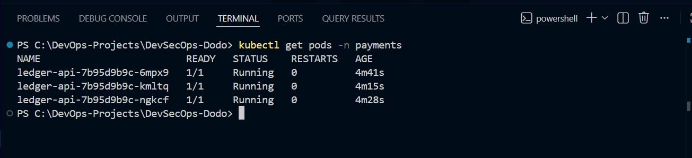

---

### Deployment

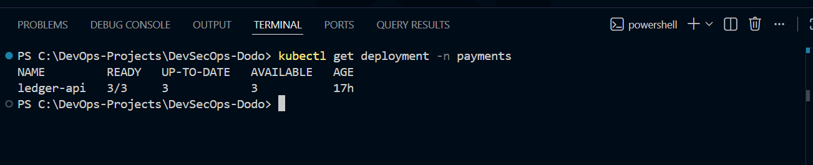

---

### Service

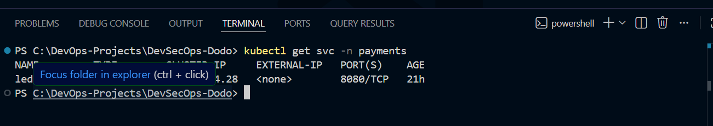

---

### Secret

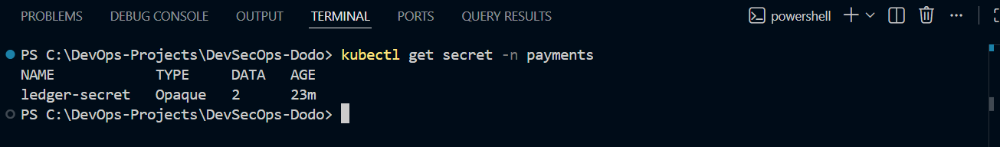

---

### Service Account

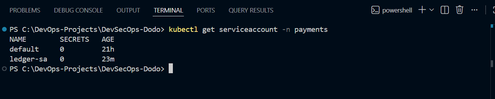

---

### RBAC

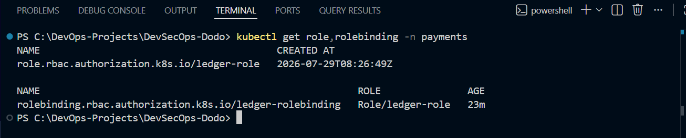

---

### ConfigMap

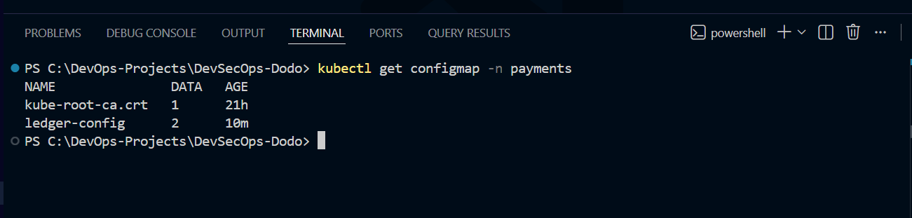

---

### Ingress

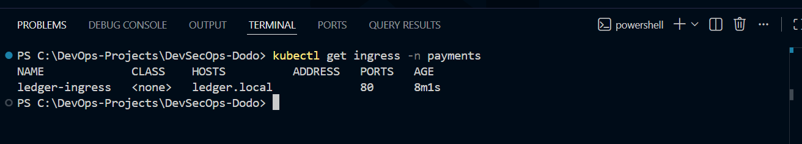

---

## API Validation

### Health API

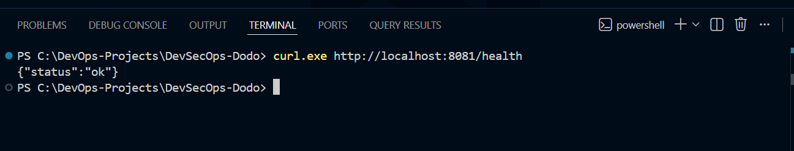

---

### Transactions API

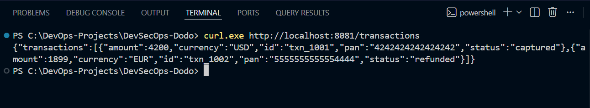

---

### Tokenization API

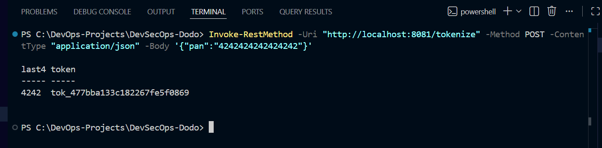

---

## Istio Zero Trust

### Istio Sidecar Injection


---

### PeerAuthentication


---

### AuthorizationPolicy


---

### NetworkPolicy


# 🎯 Project Outcome

Successfully deployed and secured the Ledger API using production-grade Kubernetes security controls.

Implemented:

- Docker Containerization
- Kubernetes Deployment
- Namespace Isolation
- RBAC
- Service Accounts
- Kubernetes Secrets
- ConfigMaps
- Security Context
- Readiness & Liveness Probes
- Resource Limits
- Ingress
- Istio Service Mesh
- STRICT mTLS
- Identity-Based AuthorizationPolicy
- Kubernetes NetworkPolicy

The deployment follows Zero Trust principles by enforcing encrypted service-to-service communication and identity-based authorization while providing defense-in-depth using Kubernetes Network Policies.
---


# 🚀 Future Improvements

- Istio Ingress Gateway
- Canary Deployment
- Horizontal Pod Autoscaler
- Prometheus Monitoring
- Grafana Dashboard
- Kyverno Policies
- OPA Gatekeeper
- External Secrets Operator
- Service Mesh Observability

---

# 👨‍💻 Author

## Mohit Yadav

**Cloud & DevOps Engineer**

### Skills

- Microsoft Azure
- Kubernetes
- Docker
- Terraform
- Linux
- GitHub Actions
- Python
- Flask
- DevSecOps
- RBAC
- Ingress
- Secrets
- CI/CD

---

# ⭐ If you found this project useful, don't forget to star the repository.