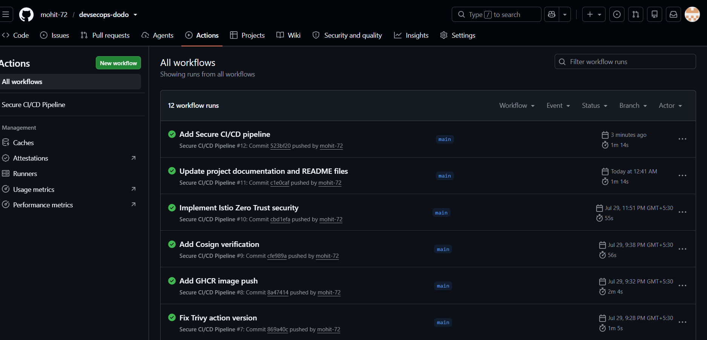

# 🔒 Secure CI/CD Pipeline with GitHub Actions & GitOps


---

# 📌 Overview

This project demonstrates a secure DevSecOps CI/CD pipeline using GitHub Actions with integrated security scanning and GitOps deployment.

The pipeline automatically validates source code, scans for secrets and vulnerabilities, builds a Docker image, signs the image, and deploys Kubernetes manifests through ArgoCD.

The objective is to implement a production-inspired Secure Software Delivery Lifecycle (SSDLC) where security checks are enforced before deployment.

---

# ✨ Features

- GitHub Actions CI Pipeline
- Docker Image Build
- GitHub Container Registry (GHCR)
- Gitleaks Secret Scanning
- Semgrep Static Code Analysis (SAST)
- Trivy Vulnerability Scanning
- Cosign Image Signing
- GitOps Deployment using ArgoCD
- Automated Kubernetes Synchronization
- Security Gates before Deployment

---

# 🏗 CI/CD Architecture

```text
Developer
     |
     | Push Code
     |
GitHub Repository
     |
GitHub Actions
     |
     +-----------------------------+
     |                             |
     | Gitleaks                    |
     | Semgrep                     |
     | Trivy                       |
     +-----------------------------+
               |
         Docker Build
               |
         GHCR Image Push
               |
          Cosign Sign
               |
           Git Repository
               |
             ArgoCD
               |
         Kubernetes Cluster
```

---

# 🛠 Technology Stack

| Category | Technology |
|----------|------------|
| CI/CD | GitHub Actions |
| Container | Docker |
| Registry | GitHub Container Registry |
| GitOps | ArgoCD |
| Secret Scanning | Gitleaks |
| SAST | Semgrep |
| Image Scanning | Trivy |
| Image Signing | Cosign |
| Orchestration | Kubernetes |

---

# 📂 Project Structure

```text
task-2-secure-cicd
│
├── .github
│   └── workflows
│       └── ci.yml
│
├── manifests
│
├── README.md
│
└── screenshots
```

---

# 🔄 CI/CD Workflow

The GitHub Actions pipeline performs the following steps:

1. Checkout source code
2. Scan repository with Gitleaks
3. Run Semgrep SAST scan
4. Build Docker image
5. Scan image using Trivy
6. Push image to GitHub Container Registry
7. Sign image using Cosign
8. Deploy through ArgoCD GitOps

---

# 🔐 Security Controls

## Gitleaks

Detects accidentally committed secrets such as:

- API Keys
- Passwords
- Tokens
- Credentials

---

## Semgrep

Performs Static Application Security Testing (SAST).

Detects:

- Insecure Coding Patterns
- Security Misconfigurations
- Common Vulnerabilities

---

## Trivy

Scans Docker images for:

- Critical Vulnerabilities
- High Vulnerabilities
- Operating System Packages
- Language Dependencies

---

## Cosign

Provides container image signing.

Benefits:

- Image Integrity
- Image Authenticity
- Supply Chain Security

---

# 🚀 GitOps Deployment

ArgoCD continuously monitors the Git repository.

Whenever Kubernetes manifests are updated:

- Detects changes
- Synchronizes automatically
- Maintains desired cluster state

---

# 📋 GitHub Secrets Used

| Secret | Purpose |
|---------|---------|
| GHCR_TOKEN | Push Docker image |
| COSIGN_PRIVATE_KEY | Image signing |
| COSIGN_PASSWORD | Unlock signing key |

---

# ✅ Verification

### GitHub Actions

```bash
GitHub → Actions
```

Expected Result

- All workflow jobs pass successfully

---

### ArgoCD

```bash
kubectl get applications -n argocd
```

Expected Result

- Healthy
- Synced

---

### Kubernetes

```bash
kubectl get pods -n payments
```

Expected Result

- All Pods Running

---

# 📸 Project Screenshots

## GitHub Actions



---

## Gitleaks Scan


---

## Semgrep Scan


---

## Trivy Scan


---

## Cosign


---

## ArgoCD


---

## Kubernetes


---

# 🎯 Project Outcome

Successfully implemented a secure DevSecOps CI/CD pipeline with integrated security controls and GitOps deployment.

Implemented:

- GitHub Actions
- Gitleaks
- Semgrep
- Trivy
- Docker
- GitHub Container Registry
- Cosign
- ArgoCD
- Kubernetes

The pipeline enforces security scanning before deployment and automatically synchronizes infrastructure using GitOps principles.

---

# 📌 Key DevSecOps Practices Demonstrated

- Secure Kubernetes Deployment
- GitOps with ArgoCD
- CI/CD Automation using GitHub Actions
- Secret Management using Kubernetes Secrets
- RBAC & Least Privilege Access
- Non-root Containers
- Readiness & Liveness Probes
- Resource Requests & Limits
- Security Scanning with Trivy, Semgrep & Gitleaks
- Container Image Signing Workflow (Cosign Ready)


# 🚀 Future Improvements

- SBOM Generation
- SLSA Provenance
- Policy as Code (OPA/Gatekeeper)
- Kyverno Admission Policies
- Dependency Track Integration
- Automated Rollbacks
- Progressive Delivery

---

# 👨‍💻 Author

## Mohit Yadav

**Cloud & DevSecOps Engineer**

### Skills

- Azure
- Kubernetes
- Docker
- Terraform
- GitHub Actions
- ArgoCD
- DevSecOps
- GitOps
- CI/CD
- Trivy
- Semgrep
- Gitleaks
- Cosign

---

# ⭐ If you found this project useful, don't forget to star the repository.