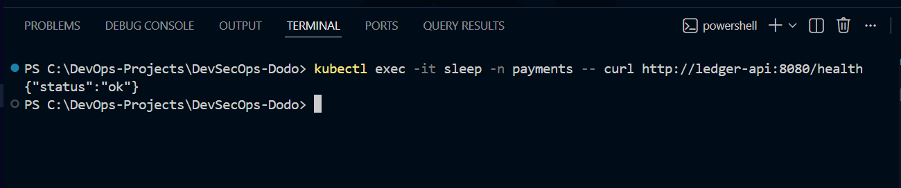
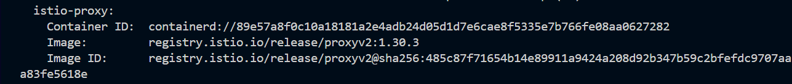

# 🔐 Zero Trust Networking with Istio Service Mesh


---

# 📌 Overview

This project demonstrates the implementation of a **Zero Trust Security Architecture** using **Istio Service Mesh** on Kubernetes.

The Ledger API is secured using Istio's security capabilities including **STRICT Mutual TLS (mTLS), Authorization Policies, Network Policies, and Envoy Sidecar Proxies** to ensure encrypted and authenticated service-to-service communication.

This implementation follows modern cloud-native security practices used in production Kubernetes environments.

---

# 🎯 Objectives

- Deploy Istio Service Mesh
- Enable Automatic Sidecar Injection
- Enforce STRICT Mutual TLS (mTLS)
- Implement Authorization Policies
- Restrict East-West traffic using Kubernetes Network Policies
- Verify secure service-to-service communication
- Demonstrate Zero Trust principles

---

# 🏗 Architecture

```text
                   +----------------------+
                   |     Client Pod       |
                   |      (sleep)         |
                   +----------+-----------+
                              |
                     mTLS Encrypted Traffic
                              |
                    +---------▼----------+
                    |   Envoy Sidecar    |
                    +---------+----------+
                              |
                 Authorization Policy Check
                              |
                    +---------▼----------+
                    |     Ledger API     |
                    |   Envoy Sidecar    |
                    +---------+----------+
                              |
                 Kubernetes Network Policy
                              |
                    ConfigMap + Secret
```

---

# 🚀 Technology Stack

| Category | Technology |
|----------|------------|
| Container Platform | Docker |
| Orchestration | Kubernetes (Kind) |
| Service Mesh | Istio |
| Security | Mutual TLS (mTLS) |
| Authorization | Istio AuthorizationPolicy |
| Network Security | Kubernetes NetworkPolicy |
| Test Client | Sleep Pod |

---

# 📂 Project Structure

```text
task-3-istio-zero-trust
│
├── manifests
│   ├── authorization-policy.yaml
│   ├── network-policy.yaml
│   ├── peer-authentication.yaml
│   └── sleep.yaml
│
├── screenshots
│   ├── 01-istio.png
│   ├── 02-mtls.png
│   ├── 03-authoz-networkpolicy.png
│   ├── 04-service-test.png
│   └── 05-istio-proxy.png
│
└── README.md
```

---

# 🔒 Security Controls Implemented

## ✅ Istio Sidecar Injection

Automatic Envoy sidecar injection was enabled for all application pods.

Benefits:

- Traffic interception
- Service identity
- Mutual TLS
- Telemetry
- Policy Enforcement

---

## ✅ STRICT Mutual TLS (mTLS)

PeerAuthentication was configured in **STRICT** mode.

This ensures:

- Encrypted communication
- Identity verification
- Protection against eavesdropping
- Secure workload authentication

---

## ✅ Authorization Policy

AuthorizationPolicy restricts communication to only trusted workloads.

Benefits:

- Zero Trust Access Control
- Least Privilege
- Service Identity Validation

---

## ✅ Kubernetes Network Policy

NetworkPolicy restricts pod-to-pod communication inside the cluster.

Benefits:

- East-West traffic protection
- Namespace isolation
- Reduced attack surface

---

## ✅ Secure Service Communication

Communication between services is verified using a dedicated **sleep** client pod.

---

# 🚀 Deployment Steps

## Enable Istio Injection

```bash
kubectl label namespace payments istio-injection=enabled --overwrite
```

---

## Apply Peer Authentication

```bash
kubectl apply -f manifests/peer-authentication.yaml
```

---

## Apply Authorization Policy

```bash
kubectl apply -f manifests/authorization-policy.yaml
```

---

## Apply Network Policy

```bash
kubectl apply -f manifests/network-policy.yaml
```

---

## Deploy Sleep Pod

```bash
kubectl apply -f manifests/sleep.yaml
```

---

# ✅ Verification

## 1️⃣ Verify Istio Sidecar Injection

```bash
kubectl get pods -n payments
```

Expected Result

```text
READY 2/2
```

This confirms successful Envoy sidecar injection.

---

## 2️⃣ Verify STRICT Mutual TLS

```bash
kubectl get peerauthentication -n payments

kubectl describe peerauthentication default -n payments
```

Expected Result

```text
MODE: STRICT
```

This confirms all service-to-service traffic is encrypted using Mutual TLS.

---

## 3️⃣ Verify Authorization & Network Policies

```bash
kubectl get authorizationpolicy -n payments

kubectl get networkpolicy -n payments
```

Expected Result

- Authorization Policy Applied
- Network Policy Applied

---

## 4️⃣ Verify Secure Service Communication

```bash
kubectl exec -it sleep -n payments -- curl http://ledger-api:8080/health
```

Expected Output

```json
{
    "status":"ok"
}
```

This confirms successful communication through the Istio Service Mesh.

---

## 5️⃣ Verify Envoy Sidecar Proxy

```bash
kubectl describe pod <ledger-api-pod> -n payments
```

Expected Result

```text
istio-proxy
```

This confirms the Envoy sidecar has been injected successfully.

---

# 📸 Screenshots

## 1. Istio Sidecar Injection


Pods running with **2/2 Ready**, confirming successful Envoy sidecar injection.

---

## 2. STRICT mTLS


PeerAuthentication configured in **STRICT** mode.

---

## 3. Authorization Policy & Network Policy


Authorization and Network Policies successfully applied.

---

## 4. Secure Service Communication Test



The sleep pod successfully communicates with the Ledger API over the Istio Service Mesh.

---

## 5. Envoy Sidecar Verification



Pod description showing the injected **istio-proxy** sidecar container.

---

# 🎯 Security Features

- ✅ Zero Trust Architecture
- ✅ Automatic Sidecar Injection
- ✅ STRICT Mutual TLS
- ✅ Authorization Policies
- ✅ Network Policies
- ✅ Service Identity Verification
- ✅ Secure East-West Traffic
- ✅ Envoy Proxy
- ✅ Least Privilege Communication

---

# 📈 Outcome

Successfully implemented a production-style **Zero Trust Architecture** using **Istio Service Mesh**.

Achievements:

- Secure service-to-service communication
- Automatic traffic encryption using mTLS
- Fine-grained authorization controls
- Network segmentation with Kubernetes Network Policies
- Envoy sidecar proxy injection
- Production-ready cloud-native security implementation

This project demonstrates practical experience with **Istio Service Mesh**, **Kubernetes Security**, and **Zero Trust Networking**, following industry best practices for securing microservices.

---

# 👨‍💻 Author

## Mohit Yadav

**Cloud & DevSecOps Engineer**

### Skills Demonstrated

- Kubernetes
- Istio Service Mesh
- Zero Trust Architecture
- Mutual TLS (mTLS)
- Kubernetes Network Policies
- Authorization Policies
- Docker
- DevSecOps
- Cloud Security

---

# ⭐ If you found this project useful, don't forget to star the repository.