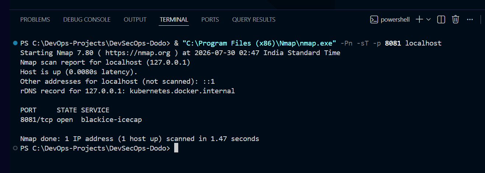
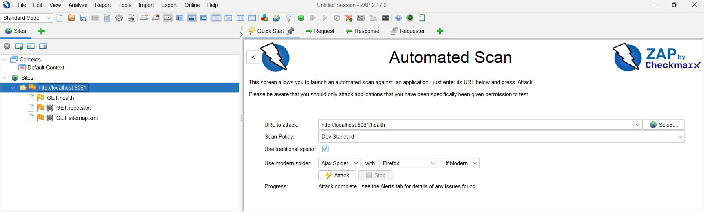
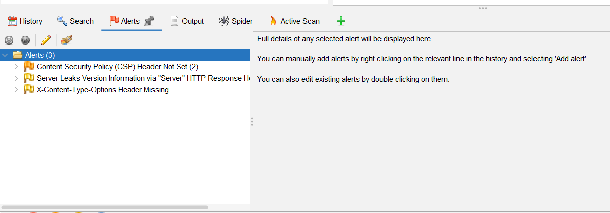
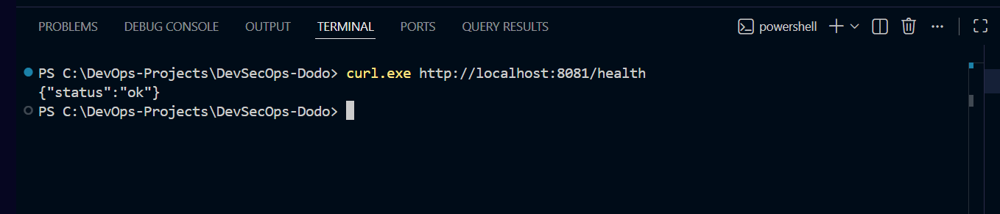
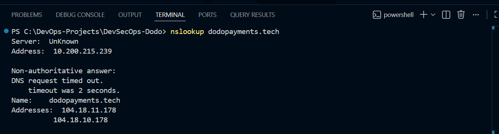
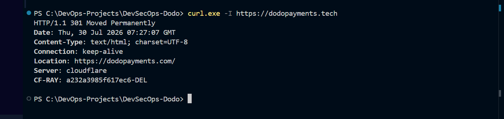
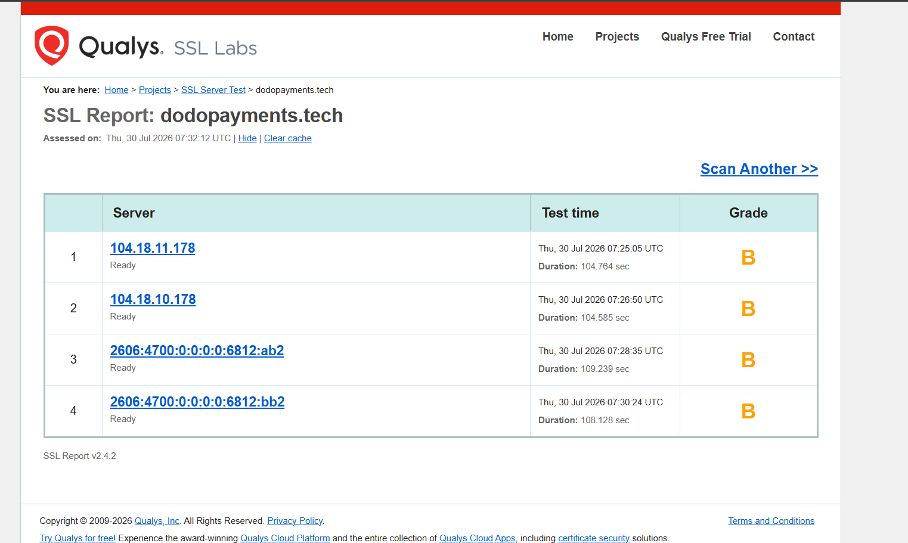

# 🔥 Enterprise Reconnaissance & Web Application Security Assessment (DevSecOps Pentest)

<p align="center">


</p>

---

# 📌 Project Overview

This project demonstrates a practical **Reconnaissance and Web Application Security Assessment** performed as part of a complete DevSecOps workflow.

The assessment was divided into two phases:

- **Part A – Passive Reconnaissance**
- **Part B – Authorized Web Application Penetration Testing**

Passive reconnaissance was performed only against publicly available information for **dodopayments.tech**, while active security testing was performed only against the locally deployed authorized Ledger API application running inside Kubernetes.

The objective was to identify the public attack surface, validate the application's security posture, and document findings using industry-standard security tools while following the defined Rules of Engagement.

---

# 🎯 Objectives

- Perform Passive Reconnaissance
- Enumerate Public Attack Surface
- Validate DNS & HTTP Exposure
- Review TLS Configuration
- Enumerate Running Services
- Perform Passive Web Security Assessment
- Document Security Findings
- Recommend Security Improvements

---

# 🏗 Assessment Methodology

```text
Passive Reconnaissance
        │
        ▼
DNS Enumeration
        │
        ▼
HTTP Header Analysis
        │
        ▼
TLS Configuration Review
        │
        ▼
Network Reconnaissance (Nmap)
        │
        ▼
Passive Web Security Assessment (OWASP ZAP)
        │
        ▼
Security Findings & Recommendations
```

---

# 🛠 Tools Used

| Tool | Purpose |
|------|----------|
| nslookup | DNS Enumeration |
| curl.exe | HTTP Header Analysis |
| SSL Labs | TLS Configuration Review |
| Nmap | Port Discovery & Service Enumeration |
| OWASP ZAP | Passive Web Security Assessment |
| Kubernetes | Application Deployment |
| Docker | Container Runtime |

---

# 🔍 Security Assessment Performed

## 1️⃣ Passive Reconnaissance

Passive reconnaissance was performed using publicly available information only.

Activities included:

- DNS Enumeration
- HTTP Header Analysis
- HTTPS Redirect Verification
- TLS Configuration Review
- Public Attack Surface Observation

Commands Used

```bash
nslookup dodopayments.tech

curl.exe -I https://dodopayments.tech
```

### Key Observations

- Domain resolved successfully.
- Cloudflare reverse proxy/CDN detected.
- HTTPS is enforced.
- The `.tech` domain redirects to the primary `.com` website.
- Minimal server information was exposed through HTTP response headers.

TLS posture was reviewed using **SSL Labs** to validate HTTPS configuration and certificate deployment. No intrusive testing was performed during this phase.

---

## 2️⃣ Network Reconnaissance

Performed TCP port discovery against the authorized local application.

```bash
nmap -Pn -sT -p 8081 localhost
```

Validated:

- Open TCP Port
- Running HTTP Service
- Reachable Application
- Service Availability

---

## 3️⃣ Passive Web Security Assessment

Performed passive security analysis using **OWASP ZAP**.

Assessment Included:

- Missing Security Headers
- Information Disclosure
- HTTP Response Analysis
- Cookie Configuration Review
- API Endpoint Discovery

No intrusive exploitation techniques were performed.

---

# 🚨 Key Findings

| Severity | Finding | Status |
|-----------|----------|---------|
| 🟢 Informational | Cloudflare Reverse Proxy / CDN Identified | Verified |
| 🟢 Informational | HTTPS Redirect (.tech → .com) | Verified |
| 🟢 Informational | Ledger API Health Endpoint Reachable | Verified |
| 🟡 Low | Missing HTTP Security Headers (OWASP ZAP) | Documented |
| 🟢 Informational | Passive Security Alerts Reviewed | Completed |

---

# 🛡 Security Recommendations

Recommended Security Improvements:

- Enable additional HTTP Security Headers
- Restrict unnecessary endpoint exposure
- Continue TLS best practices
- Harden application responses
- Validate all user inputs
- Improve centralized logging
- Enable continuous vulnerability scanning
- Periodically perform penetration testing
- Apply Zero Trust networking principles
- Continue image and dependency scanning within CI/CD

---

# 📂 Repository Structure

```text
task-4-pentest
│
├── README.md
│
├── reports
│   ├── Recon-Report.md
│   └── Pentest-Report.md
│
└── screenshots
    ├── 01-nmap.png
    ├── 02-zap-scan.png
    ├── 03-zap-alerts.png
    ├── 04-health-api.png
    ├── 05-dns.png
    ├── 06-http-headers.png
    └── 07-ssl-labs.png
```

---

# 📸 Assessment Evidence

## 🔹 Network Reconnaissance (Nmap)



---

## 🔹 OWASP ZAP Passive Scan



---

## 🔹 OWASP ZAP Security Alerts



---

## 🔹 Ledger API Health Validation



---

## 🔹 DNS Enumeration



---

## 🔹 HTTP Header Analysis



---

## 🔹 TLS Configuration Review (SSL Labs)



---

# 📑 Assessment Reports

Detailed assessment reports are available under the **reports/** directory.

## Recon-Report.md

Includes:

- Scope
- Passive Reconnaissance
- DNS Enumeration
- HTTP Header Analysis
- TLS Configuration Review
- Public Attack Surface
- Risk Observations

---

## Pentest-Report.md

Includes:

- Assessment Scope
- Methodology
- Security Findings
- Risk Analysis
- Recommendations
- Defensive Controls Mapping

---

# 📈 Assessment Outcome

This assessment successfully demonstrated a practical DevSecOps security validation workflow by combining passive reconnaissance with authorized web application security testing.

The assessment remained within the defined Rules of Engagement and avoided intrusive testing against production infrastructure.

The findings align with the defensive controls implemented in the previous tasks, including Kubernetes hardening, Zero Trust networking with Istio, and Secure CI/CD practices.

Together, Tasks 1–4 demonstrate a complete cloud-native DevSecOps lifecycle covering secure deployment, supply-chain security, Zero Trust networking, and security validation.

---

# 💡 Skills Demonstrated

- Reconnaissance (OSINT)
- DNS Enumeration
- HTTP Header Analysis
- TLS Review
- Network Reconnaissance
- Nmap
- OWASP ZAP
- Kubernetes Security
- Docker Security
- DevSecOps
- Vulnerability Assessment
- Security Reporting
- OWASP Top 10 Awareness
- Cloud Native Security

---

# 👨‍💻 Author

## Mohit Yadav

**Cloud • DevOps • DevSecOps Engineer**

Building secure cloud-native infrastructure using:

- Microsoft Azure
- Kubernetes
- Docker
- Terraform
- GitHub Actions
- ArgoCD
- Istio
- Trivy
- Semgrep
- Gitleaks
- OWASP ZAP
- Nmap

---

# ⭐ If you found this project useful, consider giving it a star.